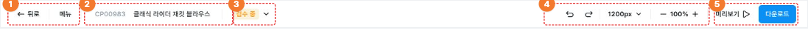
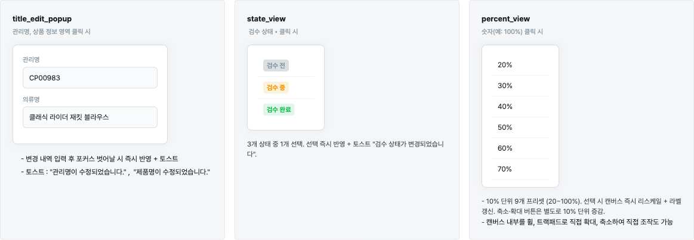

# 에디터 · 상단바 | Gency 기획서

| Chapter | Screen Path |
| :--- | :--- |
| 에디터 > 상단바 | 홈 > 에디터 > **[상단바]** |

---

## 1. 메인 화면 (Desktop · 1300px 이상)

에디터 최상단 고정 툴바. 높이 50px 고정. 좌측 A. 문서 정보 / 우측 B. 편집 도구 · C. 주요 액션

### 목업

### 영역별 상세

#### — [상단바]
- 화면명: 에디터 상단바
- 높이: 50px 고정 · 좌우 패딩 20px
- 상단바는 캔버스 스크롤 · 사이드패널 개폐와 무관하게 항상 고정

#### ① [네비게이션]
- 뒤로: 클릭 시 뒤로가기 실행
- 메뉴: 실행, 종료는 토글 동작, 상세 가이드는 별도

#### ② [관리명 · 의류명]
- **관리명**
  - 클릭 시, 수정가능한 팝업 실행
  - 최소 1글자, 전체 삭제 시, 이전 관리명으로 지정
  - 최대 50자 제한
- **의류명**
  - 클릭 시, 수정가능한 팝업 실행
  - 최소 1글자, 전체 삭제 시, 이전 제품명으로 지정
  - 최대 200자 제한
- 변경 내역 입력 후 포커스 벗어날 시 즉시 반영 + 토스트
- 토스트
  - "관리명이 수정되었습니다."
  - "제품명이 수정되었습니다."

#### ③ [검수 상태]
- 드롭다운 목록에서 **검수 전 / 검수 중 / 검수 완료** 중 1개 선택 가능
- 선택 즉시 반영 + 토스트 *"검수 상태가 변경되었습니다"*
- 라벨 색상

  | 상태 | 토큰 |
  | :--- | :--- |
  | 검수 전 | `surface/gray/strong` |
  | 검수 중 | `surface/warning/subtle-normal` |
  | 검수 완료 | `surface/success/subtle-normal` |

#### ④ [편집 도구]
- **되돌리기 / 다시 실행**: 클릭 시 변경 내용 되돌리기 혹은 다시 실행
- 단축키 툴팁으로 출력
  - 되돌리기: `⌘+Z` / `Ctrl + Z`
  - 다시실행: `⌘+⇧+V` / `Ctrl + Shift + Z`
- **캔버스 폭 (1200px ▾)**
  - 디폴트: 1200px
  - 버튼 라벨에 현재 폭 실시간 표시
- **축소 / 확대**
  - 축소·확대 버튼 클릭 시 10% 단위로 화면 축소 및 확대
  - 숫자 클릭 시 드롭다운 목록에서 10% 단위로 20~100% 중 선택하여 축소·확대 실행
  - 최소: 10%, 최대: 200%로 적용
  - 캔버스 내부를 휠, 트랙패드로 직접 확대·축소 조작도 가능

#### ⑤ [미리보기 / 다운로드]
- **미리보기**
  - 미리보기 옵션 팝업 출력
  - 상세: 세로 스크롤, 가로 스크롤, 썸네일 형식
  - 상세 내용은 추가 가이드
- **다운로드 (Primary)**
  - 클릭 시 다운로드 팝업 모달 출력
  - 상세 내용은 추가 가이드

---

## 2. 반응형 UI 변화

기준축은 뷰포트가 아닌 에디터 컨테이너 폭 (`@container`). 사이드패널 개폐로 가용 폭이 달라지기 때문.

| 영역 | L (≥ 1300) | M (900–1299) | S (768–899) | XS (≤ 767) |
| :--- | :---: | :---: | :---: | :---: |
| ① 뒤로 | 아이콘 + 텍스트 | 아이콘 + 텍스트 | 아이콘 + 텍스트 | **아이콘만** |
| ① 메뉴 | ○ | ○ | ○ | ○ |
| ② 관리명 · 의류명 | ○ | ○ | ✕ | ✕ |
| ③ 검수 상태 ▾ | ○ | ○ | ○ | ✕ |
| ④ 되돌리기 · 다시실행 | ○ | ○ | ○ | ○ |
| ④ 캔버스 폭 ▾ | ○ | ○ | ○ | ✕ |
| ④ 줌 − 100% + | ○ | ○ | ○ | ✕ |
| ⑤ 저장하기 | ○ | ○ | ○ | ○ |
| ⑤ 미리보기 | ○ | ○ | ○ | ○ |
| ⑤ 다운로드 | ○ | ○ | ○ | ○ |

> **축소 우선순위** — 문맥 정보(관리명·의류명 → 검수 상태) → 공간 차지가 큰 드롭다운(캔버스 폭 → 축소·확대) 순으로 숨긴다. 핵심 액션(되돌리기·다시실행 · 저장하기 · 미리보기 · 다운로드)은 모든 구간에서 유지.
>
> **XS 통합 메뉴** — 상단바에서 생략된 모든 기능(관리명·의류명 편집 · 검수 상태 · 캔버스 폭 · 축소·확대)의 진입점 역할. 메뉴 내부 구조 별도 정의 (Todo).

---

## 3. 연관 팝업

상단바 각 트리거에서 호출되는 팝업 구성

### `title_edit_popup`
**트리거**: 관리명, 상품 정보 영역 클릭 시

- 변경 내역 입력 후 포커스 벗어날 시 즉시 반영 + 토스트
- 토스트: "관리명이 수정되었습니다.", "제품명이 수정되었습니다."

### `state_view`
**트리거**: 검수 상태 ▾ 클릭 시

3개 상태 중 1개 선택. 선택 즉시 반영 + 토스트 "검수 상태가 변경되었습니다".

### `percent_view`
**트리거**: 숫자(예: 100%) 클릭 시

- 10% 단위 9개 프리셋 (20~100%). 선택 시 캔버스 즉시 리스케일 + 라벨 갱신.
- 축소·확대 버튼은 별도로 10% 단위 증감.
- 캔버스 내부를 휠, 트랙패드로 직접 확대·축소하여 직접 조작도 가능.

---

## 🔗 참조

- **라이브 프리뷰**: [janejiyeon.github.io/Design/2_상단바.html](https://janejiyeon.github.io/Design/2_%EC%83%81%EB%8B%A8%EB%B0%94.html)
- **원본 HTML**: [2_상단바.html](./2_상단바.html)
- **Figma 원본**: `2_2.헤더` · node `4276:8461`
- **참조 문서**: [GENCY 정책서](https://www.notion.so/studiolabai/GENCY-229094555ffe80b68a9ada0ac454f9f3) · 상세페이지 에디터 정책 정의서
- **문서 버전**: v1.0
