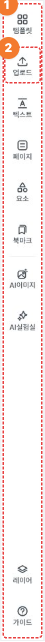

# 에디터 · 사이드바 (탭 레일) | Gency 기획서

| Chapter | Screen Path |
| :--- | :--- |
| 에디터 > 사이드바 | 홈 > 상세페이지 에디터 > **[사이드바]** |

---

## 1. 사이드바 탭 레일 (Desktop · 1300px 이상)

에디터 좌측 고정 탭 레일 (원본 64×974). 캔버스 스크롤 · 사이드패널 개폐와 무관하게 항상 고정. 진입 시 **아무 탭도 선택되지 않은 상태가 디폴트**. 콘텐츠 패널 · 페이지 맵 · 옵션 바는 본 가이드 범위 외 (별도 정의).

### 목업

### 영역별 스펙

| Num. | Description |
| :---: | :--- |
| **—** | **[탭 레일 공통]** • 화면명: 에디터 사이드바 — 탭 레일 • 너비: 64px 고정 • 높이: 에디터 콘텐츠 영역 전체 (상단바 50px 제외) • 탭 레일은 에디터 진입 시 항상 노출 · 캔버스 스크롤 · 다른 패널 개폐와 무관하게 고정 • 진입 디폴트: 아무 탭도 선택되지 않은 상태 • 탭 구성 (총 10개 · 2개 그룹으로 세로 스택) &nbsp;&nbsp;◦ 상단 그룹 (8개): 템플릿 · 업로드 · 텍스트 · 페이지 · 요소 · 북마크 · (구분선) · AI이미지 · AI기능 &nbsp;&nbsp;◦ 하단 그룹 (2개): 레이어 · 가이드 |
| **1** | **[① 탭 레일 · 탭 1개 단위]** • 크기: 64×64 · 세로 스택 · 아이콘 18×18 상단 + 캡션 11px Medium 하단 • 아이콘 · 캡션 색상 (기본): `text/default/heading` `#3d464e` • 탭 클릭 시 해당 탭의 콘텐츠 패널이 우측에 확장 (콘텐츠 패널 사양은 별도 가이드) • 탭별 진입 기능 (정책서 기준 · 탭 레일 가이드 범위) &nbsp;&nbsp;◦ 각 탭별 기능은 별도 정의 |
| **2** | **[② 탭 선택 · Hover 상태]** • 디폴트 (선택 안됨): 별도 배경 없음 • Hover: hover 효과 적용 • Selected: selected 효과 적용 / 해당 탭의 상세 패널이 출력됨 • 한 번에 1개 탭만 선택 가능 (라디오 동작) • 해제: 콘텐츠 패널 X 버튼 클릭 또는 동일 탭 재클릭 시 선택 해제 + 디폴트 상태로 복귀 |
| **—** | **[추가 정책 · 업로드 진행 배지]** • 트리거: 사용자가 업로드 탭에서 이미지 업로드 시작 시 • 표기 위치: 탭 레일의 업로드 아이콘 우상단에 오버레이 (20×20 · 배경 `#0a8ff5` · 테두리 1.5px `#0a8ff5` · radius 100px) • 배지 내부 아이콘: 위 화살표 (Icons 10×14 · 흰색) • 애니메이션: Lottie · 업로드 중 반복 재생 · 업로드 완료 시 자동 숨김 처리 • 다른 탭 전환 · 콘텐츠 패널 닫힘 상태에서도 배지는 유지됨 • Lottie 리소스: [lottiefiles.com](https://lottiefiles.com) (official@studiolab.ai 계정으로 로티 사이트 접근) |
| **—** | **[추가 정책 · 스크롤 동작]** • 탭 레일의 높이가 뷰포트에서 사용 가능한 세로 공간을 초과할 경우, 탭 레일 내부에서 수직 스크롤 발생 |
| **—** | **[추가 정책 · 다크모드]** • 탭 레일 배경: `#181b1e` · 우측 보더 `#242a2e` • 탭 아이콘 · 텍스트 (디폴트): `#eef0f2` • 탭 아이콘 · 텍스트 (Selected): `#0a8ff5` (라이트 모드와 동일) • Selected 탭 배경: `surface/tertiary/strong` 다크 모드 토큰 `#242a2e` • 구분선: `#242a2e` • 다크모드 전환 트리거 · 저장 범위는 별도 정의 필요 |

---

## 🔗 참조

- **라이브 프리뷰**: [janejiyeon.github.io/Design/3.사이드바.html](https://janejiyeon.github.io/Design/3.%EC%82%AC%EC%9D%B4%EB%93%9C%EB%B0%94.html)
- **원본 HTML**: [3.사이드바.html](./3.사이드바.html)
- **Figma 원본**: `3.사이드바` · node `8287:98457`
- **참조 문서**: [GENCY 정책서](https://www.notion.so/studiolabai/GENCY-229094555ffe80b68a9ada0ac454f9f3) · 상세페이지 에디터 정책 정의서
- **문서 버전**: v0.5 (문구 업데이트)
